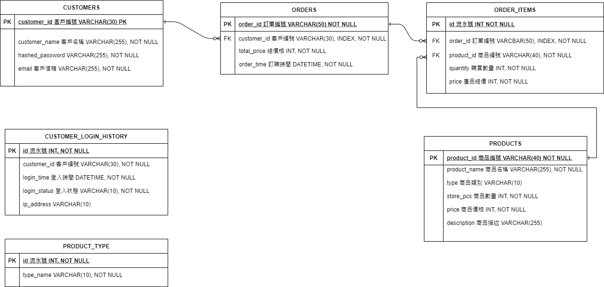

# E-shopping system
模擬線上購物網站，網站提供電影商品，提供給饅頭計畫學員開發 side project

目前提供 node.js 作為 mock server，另外也有以 python flask 開發的 api server 會作為未來正式版本使用

## Setup

    npm install

## Run express server

    node server.js


## 功能
### 後台 - 登入系統/會員管理系統 - 用 FLASK ADMIN 來做
- POST `/api/v1/admin/login` 管理員登入
  - request:
    ```json
    {
      "username": "",
      "password": ""
    }
    ```
  - response:
    ```json
    {
      "message": "Success"
    }
    ```
- POST `/api/v1/admin/logout` 管理員登出
  - response:
    ```json
    {
      "message": "Success"
    }
    ```
- POST `/api/v1/admin/signup` 管理員註冊
  - request:
    ```json
    {
      "username": "",
      "password": "",
      "email": ""
    }
    ```
  - response:
    ```json
    {
      "message": "Success"
    }
    ```

### 前台 - product page
#### 會員管理
- POST `/api/v1/signup` 註冊會員
  - request:
    ```json
    {
      "username": "",
      "password": "",
      "email": ""
    }
    ```
  - response:
    ```json
    {
      "message": "Success"
    }
    ```
- POST `/api/v1/login` 登入會員
  - request:
    ```json
    {
      "username": "",
      "password": ""
    }
    ```
  - response:
    ```json
    {
      "message": "Success"
    }
    ```
- POST `/api/v1/logout` 登出會員
  - response:
    ```json
    {
      "message": "Success"
    }
    ```
#### 商品管理
- GET `/api/v1/product` 取得產品列表
  - response:
    ```json
    {
      "data": [{
        "product_id": "f65b8846-3",
        "product_name": "來去美國2",
        "product_type": "喜剧",
        "description": "",
        "image_url": "https://localhost/xxxx.jpg",
        "movie_runtime": "1h 50m",
        "movie_score": "71.0",
        "price": 710,
        "release_date": "",
        "source_url": "https://localhost/xxxxx",
        "store_pcs": 5
      }],
      "current_page": 0,
      "current_count":0,
      "total_count":0
    }
    ```
- GET `/api/v1/product/{product_id}` 取得產品資訊
  - response:
    ```json
    {
      "product_id": "f65b8846-3",
      "product_name": "來去美國2",
      "product_type": "喜剧",
      "description": "",
      "image_url": "https://localhost/xxxx.jpg",
      "movie_runtime": "1h 50m",
      "movie_score": "71.0",
      "price": 710,
      "release_date": "",
      "source_url": "https://localhost/xxxxx",
      "store_pcs": 5
    }
    ```
- POST `/api/v1/cart` 加入單項產品至購物車
  - request:
    ```json
    {
      "product_id": "",
      "product_qty": 0,
    }
    ```
  - response:
      ```json
      {
        "product_id": "",
        "message": "Success"
      }
      ```
- GET `/api/v1/cart` 取得購物車內容
   - response:
      ```json
      {
        "data": [{
          "product_id": "",
          "product_name": "",
          "product_qty": 0,
          "product_price": "",
        }],
        "total_price": 0
      }
      ```
- PATCH `/api/v1/cart` 更新購物車內單項產品數量
  - request:
    ```json
    {
      "product_id": "",
      "product_qty": 0,
    }
    ```
  - response:
      ```json
      {
        "product_id": "",
        "message": "Success"
      }
      ```
- DELETE `/api/v1/cart` 移除購物車內單項產品
  - request:
      ```json
      {
        "product_id": ""
      }
      ```
  - response:
      ```json
      {
        "product_id": "",
        "message": "Success"
      }
      ```
#### 訂單管理
- POST `/api/v1/order` 結帳
  - response:
    ```json
    {
      "order_id": "",
      "order_date": "",
      "message": "Success"
    }
    ```

- GET `/api/v1/order` 取得訂單列表
  - response:
    ```json
    {
      "data": [{
        "order_id": "",
        "order_date": "",
        "total_price": 0
      }],
      "current_page": 0,
      "current_count":0,
      "total_count":0
    }
    ```
- POST `/api/v1/favorite` 加入產品至會員收藏
  - request:
      ```json
      {
        "product_id": ""
      }
      ```
  - response:
      ```json
      {
        "message": "Success to add a new favorite: {product_id}"
      }
      ```
- DELETE `/api/v1/favorite` 移除單項產品收藏
  - request:
      ```json
      {
        "product_id": ""
      }
      ```
  - response:
      ```json
      {
        "message": "Delete a favorite product: {product_id}"
      }
      ```
- GET `/api/v1/favorite` 會員收藏列表
  - response:
      ```json
      {
        "data": [{
          "product_id": "",
          "product_name": "",
          "product_price": "",
          "product_type": "",
          "image_url": ""
      }],
      "current_page": 0,
      "current_count":0,
      "total_count":0
      }
      ```
## database table schema
- customer
  - customer_id 客戶編號 VARCHAR(50) (PK)
  - customer_name 客戶名稱 VARCHAR(255), NOT NULL
  - hashed_password VARCHAR(255), NOT NULL
  - email 客戶信箱 VARCHAR(255), NOT NULL

- customer_login_history
  - id 流水號 INT (PK)
  - customer_id 客戶編號 VARCHAR(50), NOT NULL
  - login_time 登入時間 DATETIME, NOT NULL
  - login_status 登入狀態 VARCHAR(10), NOT NULL
  - ip_address VARCHAR(10)

- product
  - product_id 商品編號 VARCHAR(40) (PK)
  - product_name 商品名稱 VARCHAR(255), NOT NULL
  - type 商品類別 VARCHAR(10)
  - store_pcs 商品數量 INT, NOT NULL
  - price 商品價格 INT, NOT NULL
  - description 商品描述 VARCHAR(255)
  - movie_time 電影片長 VARCHAR(10)

- product_type
  - id INT (PK)
  - type_name VARCHAR(10), NOT NULL

- order
  - order_id 訂單編號 VARCHAR(50) (PK)
  - customer_id 客戶編號 VARCHAR(50) (FK)
  - total_price 總價格 INT, NOT NULL
  - order_date 訂購時間 DATETIME, NOT NULL

- order_items
  - id 流水號 (PK)
  - order_id 訂單編號 (FK) VARCHAR(50), INDEX, NOT NULL
  - product_id 商品編號 (FK) VARCHAR(40), NOT NULL
  - quantity 購買數量 INT, NOT NULL
  - price 產品總價 INT, NOT NULL 

